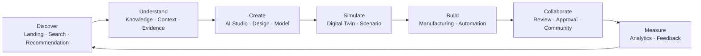
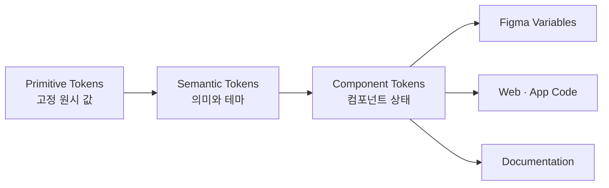
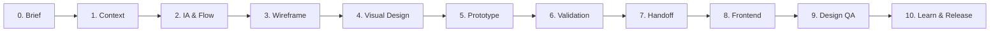
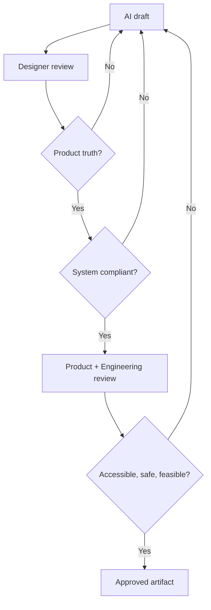

# K-Legonara Design Architecture & Workflow

> K-Legonara의 브랜드, 제품 경험, 디자인 시스템, AI 보조 제작, Figma 운영, 프론트엔드 인계까지 연결하는 장기 UI/UX 생산 기준서.

| 항목 | 내용 |
|---|---|
| 문서명 | `K-Legonara_Design_Architecture_and_Workflow.md` |
| 문서 버전 | 1.0.0 |
| 상태 | Baseline |
| 최종 갱신일 | 2026-07-29 |
| 적용 범위 | K-Legonara Web, Responsive Web, 향후 Desktop 및 Mobile 확장 |
| 주요 독자 | Product, UX, UI, Brand, Frontend, AI Design, QA, 운영 담당자 |
| 기준 브랜드 언어 | Neo Aqua Design Language |

---

## 1. 문서의 목적

이 문서는 K-Legonara의 화면을 한 번 잘 만드는 방법이 아니라, 수백 개 화면을 여러 사람이 오랫동안 일관되게 생산하는 방법을 정의한다.

핵심 목표는 다음과 같다.

1. K-Legonara만의 식별 가능한 브랜드와 제품 경험을 구축한다.
2. AI, Digital Twin, Manufacturing, Knowledge Graph, Marketplace, Community, Enterprise를 하나의 플랫폼 언어로 통합한다.
3. Figma, ChatGPT, 이미지 생성 도구, GitHub, VS Code 또는 Cursor가 같은 기준을 공유하게 한다.
4. 디자인과 구현 사이의 해석 차이, 중복 제작, 임의 색상과 컴포넌트의 증가를 줄인다.
5. AI를 속도 향상 도구로 활용하되 제품 판단과 품질 책임은 사람이 유지한다.
6. 모든 화면이 접근성, 반응형, 상태 설계, 데이터 밀도, 보안 요구를 충족하도록 한다.

이 문서는 다음 작업의 기본 입력으로 사용한다.

- 랜딩 페이지와 브랜드 페이지 제작
- 애플리케이션 셸과 대시보드 제작
- AI Studio와 AI Assistant 화면 제작
- Digital Twin과 3D Viewer 화면 제작
- Knowledge Graph와 Semantic Search 화면 제작
- Manufacturing과 Enterprise 업무 화면 제작
- Marketplace와 Community 화면 제작
- 디자인 토큰 및 공용 컴포넌트 개발
- AI 이미지 생성과 프롬프트 운영
- 디자인 QA와 프론트엔드 인계

### 1.1 범위에서 제외하는 내용

- BidCast 및 신탁공매 서비스의 브랜드, 정보 구조, 기능은 포함하지 않는다.
- 개별 제품 요구사항 문서, API 명세, 데이터 모델, 보안 아키텍처를 대체하지 않는다.
- 생성형 이미지 결과를 실제 UI 설계의 유일한 근거로 사용하지 않는다.
- 특정 참고 제품의 화면, 자산, 문구를 복제하지 않는다.

### 1.2 규범 용어

| 용어 | 의미 |
|---|---|
| MUST | 예외 없이 따라야 하는 기준 |
| SHOULD | 특별한 근거가 없으면 따라야 하는 권장 기준 |
| MAY | 상황에 따라 선택할 수 있는 기준 |

---

## 2. K-Legonara 제품 정의

K-Legonara는 단일 기능형 SaaS나 쇼핑몰이 아니다. 디자인, 생성, 제조, 지식, 협업을 AI로 연결하는 엔터프라이즈 플랫폼이다.

제품을 설명하는 기본 문장은 다음과 같다.

> Design. Create. Build. Manufacture. Collaborate. Powered by AI.

K-Legonara의 주요 도메인은 다음과 같다.

```text
K-Legonara Platform
├── AI Platform
│   ├── AI Studio
│   ├── AI Assistant
│   ├── Prompt
│   ├── Model
│   ├── Dataset
│   └── Automation
├── Digital Twin
│   ├── Brick Explorer
│   ├── 3D Viewer
│   ├── Simulation
│   ├── Factory
│   ├── Machine
│   └── Component
├── Knowledge Platform
│   ├── Knowledge
│   ├── Ontology
│   ├── Entity
│   ├── Relationship
│   ├── Semantic Search
│   ├── Reasoning
│   └── AI Memory
├── Manufacturing
│   ├── Production
│   ├── Order
│   ├── Material
│   ├── Inventory
│   └── Supplier
├── Marketplace
├── Community
└── Enterprise
    ├── Organization
    ├── Workspace
    ├── Project
    ├── Document
    ├── Analytics
    ├── Workflow
    ├── Approval
    └── Integration
```

---

## 3. 디자인 철학

### 3.1 핵심 원칙

#### Platform, not pages

개별 화면보다 사용자가 프로젝트, 데이터, 지식, 시뮬레이션 사이를 이동하는 전체 작업 흐름을 먼저 설계한다.

#### Intelligence with evidence

AI의 결과는 근거, 신뢰 수준, 데이터 출처, 생성 시각, 사용한 모델이나 규칙을 가능한 범위에서 함께 보여준다. AI를 마법처럼 표현하지 않는다.

#### Enterprise calm

화면은 전문 업무에 충분한 정보량을 제공하되 시각적으로 소란스럽지 않아야 한다. 색상, 장식, 애니메이션은 의미를 전달할 때만 사용한다.

#### Spatial clarity

K-Legonara의 핵심인 Digital Twin과 Knowledge Graph는 공간적 관계를 다룬다. 계층, 연결, 상태, 방향을 한눈에 이해할 수 있는 구조를 우선한다.

#### Progressive disclosure

초보 사용자에게는 다음 행동을 명확히 보여주고, 전문가에게는 상세 설정과 고밀도 데이터를 단계적으로 제공한다.

#### Reusable by default

반복되는 패턴은 화면별로 다시 그리지 않는다. 먼저 기존 패턴과 컴포넌트를 확인하고, 없을 때만 새 패턴을 제안한다.

#### Accessible from the start

접근성은 최종 검수 항목이 아니라 색상, 키보드, 포커스, 텍스트, 상태, 모션 설계의 시작 조건이다.

#### Human accountable

AI는 탐색안, 변형, 카피, 자산, 문서화, QA를 보조한다. 제품 책임자와 디자이너가 최종 승인하고 판단 근거를 남긴다.

### 3.2 브랜드 성격

K-Legonara는 다음 특성을 가져야 한다.

- 미래지향적이지만 공상적이지 않다.
- 기술적이지만 차갑거나 난해하지 않다.
- 정밀하지만 무겁지 않다.
- 창의적이지만 장난스럽지 않다.
- 엔터프라이즈 수준이지만 관료적이지 않다.
- 친환경적 인상을 줄 수 있지만 환경 이미지만으로 한정하지 않는다.

### 3.3 시각적 기준

| 지향 | 설명 |
|---|---|
| Premium clarity | 넉넉한 여백, 명확한 계층, 절제된 장식 |
| Neo Tech | Bright Blue와 Bright Green이 혼합된 Neo Aqua 중심 |
| Spatial intelligence | 3D, 네트워크, 데이터 흐름을 정돈된 구조로 표현 |
| Modular platform | 카드, 패널, 도킹 영역, 작업공간을 모듈식으로 구성 |
| Data confidence | 수치와 분석 결과에 단위, 기준 시점, 상태, 출처를 제공 |

### 3.4 피해야 할 표현

- 보라색 그라데이션에 의존하는 범용 AI SaaS 스타일
- 블루와 그린을 무작위로 병렬 배치한 색상 체계
- 과도한 글래스모피즘과 낮은 대비
- 의미 없는 3D 구체, 네온 회로, 로봇 얼굴의 반복
- 실제 기능보다 화려한 효과가 먼저 보이는 Hero
- 쇼핑몰처럼 보이는 과도한 상품 카드 중심 구조
- 모든 섹션을 둥근 카드 안에 넣는 카드 남용
- 같은 위계의 요소에 여러 강조색을 동시에 적용하는 방식
- 참고 제품을 그대로 모사하는 구성과 카피

---

## 4. 경험 아키텍처

### 4.1 전체 정보 계층

K-Legonara의 경험은 발견, 이해, 작업, 검증, 협업의 순환으로 설계한다.



### 4.2 랜딩 페이지 권장 구조

랜딩 페이지는 기능 목록보다 플랫폼이 연결하는 전체 가치와 실제 작업 결과를 보여준다.

```text
Global Header
Hero
AI Assistant Entry
Platform Capabilities
Digital Twin Showcase
Knowledge-to-Manufacturing Flow
Workspace Preview
Use Cases
Marketplace and Community
Enterprise Trust
Final CTA
Footer
```

#### Hero

- 핵심 메시지는 한 문장과 보조 문장으로 제한한다.
- 주요 CTA는 하나, 보조 CTA는 하나를 권장한다.
- 대표 비주얼은 Digital Twin과 Robotics 중심으로 구성한다.
- 3D 비주얼은 장식이 아니라 설계, 시뮬레이션, 제조 연결을 설명해야 한다.
- Hero Gradient는 Bright Blue에서 Neo Aqua로 흐르도록 한다.
- 실 제품 UI가 준비된 뒤에는 추상 일러스트보다 제품 데모를 우선한다.

권장 카피 골격은 다음과 같다.

```text
Eyebrow
AI · Digital Twin · Knowledge · Manufacturing

Headline
Design. Create. Build. Manufacture.

Supporting copy
AI와 디지털 트윈, 지식, 제조 워크플로를 하나의 플랫폼에서 연결합니다.

Primary CTA
Start building

Secondary CTA
Explore platform
```

#### 랜딩 페이지 콘텐츠 규칙

- 한 섹션은 하나의 핵심 주장만 가진다.
- 주장은 제품 화면, 데이터, 사례, 데모 중 하나로 증명한다.
- 기능명보다 사용자의 결과와 흐름을 먼저 설명한다.
- 엔터프라이즈 신뢰 영역에는 보안, 권한, 감사, 통합, 배포 옵션을 포함한다.
- Marketplace와 Community는 플랫폼의 중심이 아니라 생태계 확장 영역으로 보여준다.

### 4.3 애플리케이션 셸

참고 디자인에서 검증된 좌측 내비게이션, 중앙 작업영역, 선택적 우측 패널 구조를 K-Legonara에 맞게 확장한다.

```text
┌──────────────┬──────────────────────────────────┬──────────────────┐
│ Left Nav     │ Top Bar                          │ Context Panel    │
│              ├──────────────────────────────────┤                  │
│ Product      │                                  │ AI Assistant     │
│ Domains      │ Main Workspace                   │ Properties       │
│              │                                  │ Activity         │
│ Workspace    │ Canvas · Table · Dashboard       │ Notifications    │
│ Utilities    │                                  │                  │
└──────────────┴──────────────────────────────────┴──────────────────┘
```

#### 좌측 내비게이션

- 제품 도메인과 현재 워크스페이스 문맥을 분리한다.
- 최상위 항목은 7개 안팎을 권장한다.
- 자주 쓰지 않는 관리 기능은 별도 영역에 둔다.
- 접힌 상태에서도 아이콘과 툴팁으로 이해할 수 있어야 한다.
- 사용자 권한에 없는 기능은 숨김 또는 명확한 제한 상태로 표현한다.

권장 그룹은 다음과 같다.

```text
Core
├── Home
├── AI Studio
├── Digital Twin
├── Knowledge
├── Manufacturing
├── Marketplace
└── Community

Workspace
├── Projects
├── Documents
├── Datasets
└── Automations

Enterprise
├── Analytics
├── Workflows
├── Approvals
└── Integrations

Utility
├── Notifications
├── Help
└── Settings
```

#### 상단 바

- 현재 조직, 워크스페이스, 프로젝트의 위치를 보여준다.
- 통합 검색 또는 Ask AI 진입점을 제공한다.
- 저장, 공유, 실행처럼 현재 작업에 직접 관련된 행동만 둔다.
- 프로필과 글로벌 설정은 오른쪽 끝에 고정한다.

#### 우측 컨텍스트 패널

- 항상 열려 있는 고정 광고 영역으로 사용하지 않는다.
- 선택한 객체의 속성, AI 도움, 활동, 버전, 알림을 문맥에 따라 제공한다.
- 사용자가 닫거나 크기를 조정할 수 있어야 한다.
- 좁은 화면에서는 드로어 또는 하단 시트로 전환한다.

#### 중앙 작업영역

- 화면의 목적에 따라 Canvas, Table, Dashboard, Editor, Viewer 패턴 중 하나를 기본으로 선택한다.
- 도구 모음, 필터, 데이터, 상세정보가 같은 위계로 경쟁하지 않도록 한다.
- 빈 상태, 로딩, 오류, 권한 제한, 부분 성공 상태를 처음부터 설계한다.

### 4.4 도메인별 UI 원칙

#### AI Studio

- Prompt, Context, Tool, Model, Output을 구분해 보여준다.
- 실행 전 비용, 권한, 데이터 범위를 예측 가능하게 한다.
- 생성 결과에 출처, 모델, 시각, 버전, 재현 가능 정보를 표시한다.
- 승인 없이 위험한 자동화를 실행하지 않는다.

#### Digital Twin

- 3D 뷰어의 장면, 계층 트리, 속성, 타임라인을 명확히 분리한다.
- 선택 상태는 색상만이 아니라 윤곽, 라벨, 패널 상태로 함께 표시한다.
- 실시간과 시뮬레이션 데이터를 혼동하지 않게 배지와 시간축을 제공한다.
- 고사양 3D가 어려운 환경을 위한 저사양 모드와 표 기반 대체 수단을 고려한다.

#### Knowledge Graph

- 노드 색상만으로 엔터티 유형을 구분하지 않는다.
- 관계의 방향, 종류, 신뢰도, 출처를 확인할 수 있어야 한다.
- 그래프 탐색과 표 또는 상세 패널을 함께 제공한다.
- 대규모 그래프는 클러스터링, 단계적 확장, 검색 중심으로 다룬다.

#### Manufacturing

- 생산 상태와 경고는 시맨틱 색상과 텍스트를 함께 사용한다.
- 단위, 시간대, 설비 ID, 데이터 최신성을 명시한다.
- 비가역적 명령은 확인, 권한, 감사 기록을 요구한다.
- 대시보드보다 실제 의사결정과 조치 흐름을 먼저 설계한다.

#### Marketplace

- 제작자, 자산, 라이선스, 호환성, 버전, 검증 상태를 핵심 정보로 제공한다.
- 카드 시각보다 신뢰 정보와 검색·필터 품질을 우선한다.
- 엔터프라이즈 구매, 승인, 라이선스 관리 흐름을 고려한다.

#### Enterprise

- 역할과 권한, 조직과 워크스페이스의 경계를 항상 식별 가능하게 한다.
- 감사 로그, 승인, 정책, 통합 상태를 추적할 수 있어야 한다.
- 데이터 밀도를 높이더라도 계층, 필터, 고정 열, 요약을 통해 가독성을 유지한다.

---

## 5. Neo Aqua Brand Color System

### 5.1 브랜드 색상의 정의

Neo Aqua는 Bright Blue와 Bright Green을 하나의 색 경험으로 혼합한 K-Legonara의 대표 색상이다. Blue와 Green을 각각 경쟁하는 포인트 색으로 사용하지 않고, Neo Aqua를 중심으로 일관된 인상을 만든다.

### 5.2 확정 핵심 팔레트

| 역할 | 이름 | 값 | 주요 용도 |
|---|---|---:|---|
| Primary | Neo Aqua | `#22C7B8` | 브랜드, 주요 선택 상태, 그래픽 |
| Primary Hover | Deep Aqua | `#18B8A9` | Hover, Active 보조 |
| Secondary | Bright Blue | `#2EA8FF` | 링크, 정보, 그래디언트 시작 |
| Accent | Bright Green | `#52E67D` | 제한적 강조, 성장, 활성 에너지 |
| Hero Gradient | Blue → Aqua | `#2EA8FF → #22C7B8` | Hero와 브랜드 순간 |
| Background | Ice White | `#F7FBFC` | 앱과 랜딩 기본 배경 |
| Surface | White | `#FFFFFF` | 카드, 패널, 모달 |
| Border | Soft Cyan Gray | `#DCEEF0` | 기본 경계와 구분 |
| Success | Success Green | `#32D583` | 성공 상태 |
| Warning | Warning Amber | `#FFB020` | 주의 상태 |
| Error | Error Red | `#F04438` | 실패와 위험 상태 |

### 5.3 사용 원칙

- 브랜드 대표색은 `#22C7B8`이다.
- 본문 텍스트에 Neo Aqua를 직접 사용하지 않는다.
- 큰 면적의 배경은 Ice White 또는 White를 기본으로 한다.
- 강한 브랜드 색 면적은 한 화면의 약 10% 이내를 시작점으로 삼는다.
- Bright Green은 장식보다 상태와 핵심 순간에 제한적으로 사용한다.
- Success Green과 Accent Green은 역할이 다르므로 서로 대체하지 않는다.
- Error, Warning, Success는 브랜드 분위기를 위해 색조를 임의 변경하지 않는다.
- 그래디언트는 Hero, 핵심 프로모션, 데이터 흐름 그래픽처럼 브랜드 순간에만 사용한다.
- 그래디언트 위 텍스트는 실제 대비를 측정하고, 필요하면 어두운 오버레이 또는 단색 영역을 사용한다.

### 5.4 권장 중립색

핵심 팔레트를 지원하는 중립색은 실제 UI 제작 시 토큰으로 관리한다.

| 토큰 | 값 | 용도 |
|---|---:|---|
| Neutral 950 | `#102A2E` | 주요 텍스트, 아이콘 |
| Neutral 800 | `#244348` | 강한 보조 텍스트 |
| Neutral 700 | `#3E5C61` | 보조 텍스트 |
| Neutral 600 | `#5B7479` | 메타 정보 |
| Neutral 400 | `#9AB0B4` | 비활성 아이콘 |
| Neutral 300 | `#BDD0D3` | 강한 경계 |
| Neutral 200 | `#DCE8EA` | 기본 경계 |
| Neutral 100 | `#EDF4F5` | Subtle surface |
| Neutral 50 | `#F7FBFC` | 페이지 배경 |

중립색은 색상 대비 검증 후 제품 토큰으로 확정한다. 브랜드 원색만으로 접근성 적합성을 추정하지 않는다.

### 5.5 시맨틱 색상

| 의미 | 배경 | 텍스트·아이콘 | 경계 |
|---|---|---|---|
| Brand subtle | `color.brand.50` | `color.brand.800` | `color.brand.200` |
| Info | `color.info.50` | `color.info.800` | `color.info.200` |
| Success | `color.success.50` | `color.success.800` | `color.success.200` |
| Warning | `color.warning.50` | `color.warning.900` | `color.warning.300` |
| Error | `color.error.50` | `color.error.800` | `color.error.200` |

### 5.6 접근성 기준

- 일반 텍스트는 WCAG AA 기준 4.5:1 이상을 MUST로 한다.
- 큰 텍스트와 굵은 제목은 3:1 이상을 MUST로 한다.
- 아이콘, 포커스 링, 입력 경계처럼 의미 있는 비텍스트 요소는 3:1 이상을 MUST로 한다.
- 상태를 색상만으로 전달하지 않는다.
- 버튼의 텍스트 대비가 부족하면 Neo Aqua 원색을 고집하지 말고 더 어두운 시맨틱 토큰을 사용한다.
- 다크 모드는 단순 색상 반전으로 만들지 않고 별도 시맨틱 토큰 세트로 설계한다.

핵심 색상의 sRGB 기준 초기 대비 측정값은 다음과 같다.

| 전경과 배경 | 대비 | 초기 판단 |
|---|---:|---|
| Neo Aqua `#22C7B8` / White `#FFFFFF` | 2.11:1 | 일반 텍스트와 비텍스트 경계에 부적합 |
| Neo Aqua `#22C7B8` / Neutral 950 `#102A2E` | 7.13:1 | 일반 텍스트에 적합 |
| Deep Aqua `#18B8A9` / White `#FFFFFF` | 2.48:1 | 일반 텍스트에 부적합 |
| Bright Blue `#2EA8FF` / White `#FFFFFF` | 2.57:1 | 일반 텍스트에 부적합 |
| Bright Green `#52E67D` / Neutral 950 `#102A2E` | 9.32:1 | 일반 텍스트에 적합 |
| Neutral 950 `#102A2E` / Ice White `#F7FBFC` | 14.48:1 | 주요 본문에 적합 |
| Neutral 700 `#3E5C61` / White `#FFFFFF` | 7.22:1 | 보조 본문에 적합 |
| Neutral 600 `#5B7479` / White `#FFFFFF` | 4.98:1 | 일반 본문의 최소 기준 충족 |

따라서 Neo Aqua 버튼에는 흰색보다 `#102A2E` 계열의 어두운 텍스트를 우선한다. 위 수치는 초기 팔레트의 단순 조합 결과이며 실제 컴포넌트의 크기, 굵기, 투명도, 그래디언트, 상태별 배경을 별도로 다시 측정해야 한다.

---

## 6. 디자인 파운데이션

### 6.1 타이포그래피

언어별 가독성과 숫자 정렬을 우선한다.

권장 폰트 스택은 다음과 같다.

```css
font-family:
  "Inter",
  "Pretendard Variable",
  "Pretendard",
  "Noto Sans KR",
  system-ui,
  -apple-system,
  "Segoe UI",
  sans-serif;
```

| 스타일 | 크기·행간 | 굵기 | 용도 |
|---|---|---|---|
| Display XL | 64/72 | 650 | 대형 랜딩 Hero |
| Display L | 52/62 | 650 | 일반 랜딩 Hero |
| Heading 1 | 40/48 | 650 | 페이지 대표 제목 |
| Heading 2 | 32/40 | 650 | 주요 섹션 |
| Heading 3 | 24/32 | 600 | 하위 섹션 |
| Title L | 20/28 | 600 | 카드·패널 제목 |
| Title M | 18/26 | 600 | 모달·목록 그룹 |
| Body L | 16/26 | 400 | 랜딩 본문 |
| Body M | 14/22 | 400 | 앱 기본 본문 |
| Label M | 14/20 | 550 | 버튼·필드 |
| Caption | 12/18 | 450 | 메타 정보 |
| Data M | 14/20 | 500 | 표와 수치 |

타이포그래피 규칙은 다음과 같다.

- 한국어 본문의 기본 행간은 글자 크기의 약 1.5배 이상을 권장한다.
- 숫자 중심 화면은 tabular numerals를 사용한다.
- 대문자 영문 라벨은 짧은 Eyebrow와 상태 코드에만 제한한다.
- 제목 굵기를 과도하게 높이지 않는다.
- 한 화면에 5개 이상의 글자 크기가 경쟁하지 않게 한다.
- 데이터의 단위와 기준 시점은 숫자와 시각적으로 연결한다.

### 6.2 간격 시스템

기본 단위는 4px이다. 주요 레이아웃은 8px 배수를 우선한다.

| 토큰 | 값 |
|---|---:|
| `space.0` | 0px |
| `space.1` | 4px |
| `space.2` | 8px |
| `space.3` | 12px |
| `space.4` | 16px |
| `space.5` | 20px |
| `space.6` | 24px |
| `space.8` | 32px |
| `space.10` | 40px |
| `space.12` | 48px |
| `space.16` | 64px |
| `space.20` | 80px |
| `space.24` | 96px |

### 6.3 그리드와 컨테이너

| 화면 | 열 | Gutter | Margin | 권장 동작 |
|---|---:|---:|---:|---|
| Large desktop, 1440px 이상 | 12 | 24px | 64px 이상 | 최대 폭 컨테이너 |
| Desktop, 1024–1439px | 12 | 20px | 32px | 패널 축소 가능 |
| Tablet, 768–1023px | 8 | 16px | 24px | 우측 패널 드로어화 |
| Mobile, 360–767px | 4 | 16px | 16px | 단일 열 중심 |

- 랜딩 콘텐츠 최대 폭은 1200–1280px를 권장한다.
- 고밀도 앱은 셸 전체를 사용하되 중앙 작업영역의 최소 폭을 보장한다.
- 3D Viewer와 그래프는 고정 카드 안에 억지로 넣지 않고 사용 가능한 영역을 최대화한다.
- 표는 모바일에서 열을 무조건 축소하지 않고 우선순위, 카드 변환, 가로 스크롤을 선택한다.

### 6.4 반경

| 토큰 | 값 | 용도 |
|---|---:|---|
| `radius.sm` | 6px | 칩, 작은 컨트롤 |
| `radius.md` | 10px | 입력, 버튼 |
| `radius.lg` | 14px | 카드, 패널 |
| `radius.xl` | 20px | Hero 패널, 큰 모달 |
| `radius.full` | 999px | Avatar, 상태 점, Pill |

둥근 모서리는 정보 구조를 대체하지 않는다. 표, 도킹 패널, 전문 편집기는 더 작은 반경을 사용할 수 있다.

### 6.5 그림자와 경계

| 토큰 | 권장 값 | 용도 |
|---|---|---|
| `shadow.xs` | `0 1px 2px rgba(16,42,46,.06)` | 필드, 작은 카드 |
| `shadow.sm` | `0 4px 12px rgba(16,42,46,.08)` | 메뉴, 떠 있는 카드 |
| `shadow.md` | `0 12px 32px rgba(16,42,46,.12)` | Popover, Modal |
| `shadow.focus` | `0 0 0 3px rgba(34,199,184,.28)` | 키보드 포커스 |

- 기본 카드 구분은 그림자보다 배경과 1px 경계를 우선한다.
- 그림자는 실제 높이와 상호작용 계층을 나타낼 때만 사용한다.
- 글래스 효과는 Hero 또는 떠 있는 일시적 레이어에 제한한다.
- 글래스 표면의 텍스트 대비와 배경 변화에 따른 가독성을 검증한다.

### 6.6 아이콘

- 기본은 1.5–2px 굵기의 단순한 선형 아이콘을 사용한다.
- 같은 화면에서 서로 다른 아이콘 제품군을 섞지 않는다.
- 16, 20, 24px를 기본 크기로 한다.
- 아이콘 단독 버튼에는 접근 가능한 이름과 툴팁을 제공한다.
- 3D, 제조, 지식 그래프의 도메인 아이콘은 별도 세트로 관리하되 기본 광학 규칙을 공유한다.

### 6.7 이미지와 3D 비주얼

- Hero 대표 비주얼은 Digital Twin과 Robotics를 중심으로 한다.
- 시각 자산은 AI, 데이터, 지식, 설계, 제조의 연결을 설명해야 한다.
- 실제 제품과 다른 UI 텍스트를 이미지 안에 생성하지 않는다.
- 3D 자산은 라이선스, 폴리곤 수, 텍스처, 포맷, 제작 출처를 기록한다.
- 이미지 안의 중요한 정보에는 대체 텍스트 또는 본문 설명을 제공한다.

### 6.8 모션

| 유형 | 시간 | Easing | 용도 |
|---|---:|---|---|
| Micro | 100–160ms | ease-out | Hover, Press, Toggle |
| Standard | 180–240ms | ease-out | Menu, Tooltip, Panel |
| Emphasis | 280–400ms | custom | Modal, Canvas transition |
| Spatial | 상황별 | physical | 3D Camera, Graph expand |

- 모션은 원인과 결과를 연결하고 공간 변화를 설명해야 한다.
- 로딩 장식이나 브랜드 과시를 위해 지속 애니메이션을 남용하지 않는다.
- `prefers-reduced-motion`을 지원한다.
- 3D 카메라 이동은 멀미와 방향 상실을 줄이도록 중단과 복귀 수단을 제공한다.

---

## 7. 디자인 토큰 아키텍처

### 7.1 세 계층



#### Primitive

색상, 간격, 크기처럼 문맥이 없는 원시 값이다.

```text
color.aqua.500
color.blue.500
color.neutral.950
space.4
radius.md
duration.fast
```

#### Semantic

UI 의미와 테마를 표현한다.

```text
color.bg.canvas
color.bg.surface
color.text.primary
color.text.secondary
color.border.default
color.action.primary.bg
color.status.error.text
```

#### Component

특정 컴포넌트와 상태를 표현한다.

```text
button.primary.bg.default
button.primary.bg.hover
input.border.focus
card.shadow.default
navigation.item.bg.selected
```

### 7.2 토큰 규칙

- 컴포넌트 코드에서 Hex 값을 직접 사용하지 않는다.
- 새 값이 필요하면 기존 토큰 조합으로 해결 가능한지 먼저 확인한다.
- 의미가 다른 값은 우연히 같은 Hex여도 별도 시맨틱 토큰을 가질 수 있다.
- 이름에 색상 표현보다 역할을 우선한다.
- Figma와 코드의 토큰 이름을 최대한 동일하게 유지한다.
- 토큰 변경은 시각 회귀 테스트와 영향 범위를 확인한다.
- 제품별 임의 별칭을 만들지 않고 플랫폼 공용 의미를 먼저 검토한다.

### 7.3 토큰 예시

```json
{
  "color": {
    "brand": {
      "primary": { "$value": "#22C7B8", "$type": "color" },
      "primaryHover": { "$value": "#18B8A9", "$type": "color" },
      "secondary": { "$value": "#2EA8FF", "$type": "color" },
      "accent": { "$value": "#52E67D", "$type": "color" }
    },
    "background": {
      "canvas": { "$value": "#F7FBFC", "$type": "color" },
      "surface": { "$value": "#FFFFFF", "$type": "color" }
    },
    "border": {
      "default": { "$value": "#DCEEF0", "$type": "color" }
    }
  }
}
```

CSS 변수 예시는 다음과 같다.

```css
:root {
  --kl-color-brand-primary: #22c7b8;
  --kl-color-brand-primary-hover: #18b8a9;
  --kl-color-brand-secondary: #2ea8ff;
  --kl-color-brand-accent: #52e67d;
  --kl-color-bg-canvas: #f7fbfc;
  --kl-color-bg-surface: #ffffff;
  --kl-color-border-default: #dceef0;
}
```

### 7.4 동기화의 원칙

토큰 원본은 Git 저장소의 기계 판독 가능한 파일로 관리한다. Figma Variables는 디자이너가 사용하는 동기화 대상이다.

```text
Token source in Git
       ↓
Validation and build
       ↓
Figma Variables + CSS/TS + Documentation
       ↓
Visual regression and release
```

수동 복사만으로 동기화를 운영하지 않는다. 초기에는 수동 절차로 시작할 수 있지만 변경 기록과 검증은 반드시 남긴다.

---

## 8. 컴포넌트 라이브러리 전략

### 8.1 계층

```text
Foundations
├── Color
├── Typography
├── Spacing
├── Grid
├── Icon
└── Motion

Primitives
├── Button
├── Input
├── Select
├── Checkbox
├── Radio
├── Switch
├── Badge
├── Tooltip
└── Divider

Composites
├── Search
├── Filter Bar
├── Form Field
├── Card
├── Table
├── Tree
├── Tabs
├── Modal
├── Drawer
├── Toast
└── Command Palette

Patterns
├── App Shell
├── Empty State
├── Data Explorer
├── AI Response
├── Approval Flow
├── Property Panel
├── Activity Timeline
└── Permission Gate

Domain Modules
├── AI Prompt Composer
├── Model Selector
├── Twin Viewer Controls
├── Scene Tree
├── Simulation Timeline
├── Knowledge Graph Canvas
├── Entity Inspector
├── Manufacturing Status Board
└── Marketplace Asset Card
```

### 8.2 컴포넌트 생성 기준

새 컴포넌트는 다음 조건을 충족할 때 만든다.

1. 두 개 이상의 화면에서 반복되거나 곧 반복될 근거가 있다.
2. 시각뿐 아니라 동작과 상태 규칙을 공유한다.
3. 접근성과 테스트 책임을 중앙화할 가치가 있다.
4. 기존 컴포넌트의 속성 조합으로 해결할 수 없다.

한 번만 쓰는 UI를 미래 가능성만으로 공용 컴포넌트화하지 않는다.

### 8.3 필수 상태

모든 인터랙티브 컴포넌트는 해당하는 상태를 정의한다.

```text
Default
Hover
Pressed
Focus-visible
Selected
Disabled
Loading
Error
Read-only
Empty
Permission-limited
```

### 8.4 Variant와 Property 규칙

- Variant 이름은 `Type`, `Size`, `State`, `Tone` 순으로 정리한다.
- 불리언 속성은 `Has icon`, `Show label`처럼 의도를 드러낸다.
- Figma의 구조가 코드 API와 완전히 같을 필요는 없지만 의미는 일치해야 한다.
- 한 컴포넌트에 너무 많은 독립 속성이 생기면 구성 요소를 분리한다.
- Slot 기반 구성은 사용 가능하지만 허용 범위와 금지 조합을 문서화한다.

### 8.5 핵심 컴포넌트 품질 기준

| 항목 | 필수 확인 |
|---|---|
| Button | 키보드, 로딩, 아이콘 단독, 위험 행동 |
| Form | Label, Help, Error, Required, Autofill |
| Table | 정렬, 필터, 고정 열, 선택, 빈 상태, 로딩 |
| Modal | Focus trap, Escape, 복귀 포커스, 위험 확인 |
| Navigation | 현재 위치, 접힘, 권한, 모바일 |
| AI Response | 출처, 복사, 피드백, 재생성, 오류 |
| Viewer | 키보드 대체, 선택, 확대, 리셋, 성능 |
| Graph | 범례, 검색, 필터, 표 대체, 관계 상세 |

### 8.6 라이브러리 릴리스

- 변경은 `Added`, `Changed`, `Deprecated`, `Removed`, `Fixed`로 기록한다.
- 호환성을 깨는 변경은 Major 버전으로 올린다.
- Deprecated 컴포넌트는 대체 방법과 제거 예정 버전을 표시한다.
- 컴포넌트 스크린샷과 Storybook 또는 동등한 문서를 함께 유지한다.
- 핵심 화면에 대한 시각 회귀 테스트를 운영한다.

---

## 9. 반응형과 다중 환경 전략

### 9.1 기본 원칙

- Mobile-first CSS를 사용할 수 있지만 업무 시나리오는 Desktop-first일 수 있다.
- 반응형은 크기 축소가 아니라 정보 우선순위와 조작 방식의 변화다.
- Canvas, Graph, 3D Viewer는 모바일에서 읽기 전용 또는 제한 모드가 될 수 있으며 이를 명확히 안내한다.
- 터치 목표는 최소 44×44px을 권장한다.
- Hover에만 존재하는 기능은 금지한다.

### 9.2 패턴 변환

| Desktop | Tablet | Mobile |
|---|---|---|
| 고정 Left Nav | 축소 Nav | Bottom 또는 Drawer Nav |
| Right Context Panel | Overlay Drawer | Bottom Sheet |
| 다열 Dashboard | 2열 | 1열 |
| Dense Table | 선택 열 | Card 또는 가로 스크롤 |
| Hover Tooltip | Tap Tooltip | Inline help |
| Split View | 전환형 View | 단계형 View |

### 9.3 국제화

- 한국어와 영어 길이 차이를 허용하도록 Auto Layout을 기본으로 한다.
- 버튼과 탭의 고정 폭을 최소화한다.
- 날짜, 숫자, 단위, 시간대는 Locale을 따른다.
- 향후 RTL 가능성이 있으면 방향 아이콘과 배치를 토큰화한다.

---

## 10. Figma 운영 구조

Figma는 시각 설계, 프로토타입, 리뷰의 원본이다. 승인된 토큰과 구현 코드는 Git 저장소가 원본이다.

### 10.1 Team과 Project 구조

```text
K-Legonara Team
├── 00_Brand
├── 01_Foundations
├── 02_Component_Library
├── 03_Product_Patterns
├── 10_Landing_and_Marketing
├── 20_Core_Platform
├── 21_AI_Studio
├── 22_Digital_Twin
├── 23_Knowledge
├── 24_Manufacturing
├── 25_Marketplace
├── 26_Community
├── 27_Enterprise
├── 80_Research_and_Exploration
├── 90_Archive
└── 99_Playground
```

### 10.2 파일 구성

기능 단위 파일의 페이지는 다음 구조를 권장한다.

```text
00_Cover
01_Readme
02_Flow
03_Wireframe
04_Design
05_Responsive
06_Prototype
07_Handoff
08_QA
90_Archive
```

### 10.3 페이지 역할

| 페이지 | 내용 |
|---|---|
| Cover | 제품 영역, 담당자, 상태, 버전, 마지막 갱신 |
| Readme | 범위, 요구사항, 링크, 의사결정 |
| Flow | 사용자 흐름과 상태 전이 |
| Wireframe | 구조 검토용 저충실도 안 |
| Design | 승인 후보와 최종 고충실도 화면 |
| Responsive | 주요 Breakpoint 변형 |
| Prototype | 핵심 상호작용과 테스트 흐름 |
| Handoff | 확정 화면, 주석, 토큰, 엣지 케이스 |
| QA | 구현 캡처, 차이, 해결 상태 |
| Archive | 폐기안과 과거 버전 |

### 10.4 레이어와 프레임 이름

```text
[Domain]/[Feature]/[Screen]/[State]/[Breakpoint]

예시
AI/Prompt/Composer/Default/Desktop
Twin/Viewer/Scene/Loading/Desktop
Knowledge/Search/Results/Empty/Mobile
```

레이어 이름은 역할 중심으로 작성한다.

```text
page
header
navigation
main
toolbar
content
aside
footer
```

`Frame 123`, `Rectangle 45` 같은 기본 이름을 최종 인계에 남기지 않는다.

### 10.5 Variables와 Styles

- Variables Collection은 `Primitives`, `Semantics`, `Components`로 나눈다.
- Mode는 초기에는 `Light`를 기본으로 하고 검증된 경우에만 `Dark`, `High Contrast`를 추가한다.
- Text Style, Effect Style, Grid Style을 토큰 규칙과 연결한다.
- 로컬 색상 스타일과 임의 Hex 사용을 정기 점검한다.

### 10.6 Branch와 리뷰

- 대규모 변경은 Figma Branch에서 진행한다.
- Branch 이름은 `feature/<domain>-<short-name>` 형식을 권장한다.
- 리뷰 요청에는 목표, 변경점, 확인할 질문, 영향 화면을 포함한다.
- 승인 후 Merge하고 변경 로그를 갱신한다.
- 탐색안은 라이브러리에 바로 Publish하지 않는다.

### 10.7 Figma 파일 성능

- 페이지와 컴포넌트가 과도하게 커지면 도메인별 파일로 분리한다.
- 숨긴 대형 이미지와 사용하지 않는 Variant를 정리한다.
- 벡터 노드와 블러 효과를 필요한 수준으로 제한한다.
- 프로토타입 연결은 검증할 핵심 흐름에 집중한다.

---

## 11. 디자인 문서 체계

권장 문서 트리는 다음과 같다.

```text
docs/design/
├── 000_DESIGN_MANIFESTO.md
├── 001_BRAND_GUIDE.md
├── 002_COLOR_SYSTEM.md
├── 003_TYPOGRAPHY.md
├── 004_SPACING_AND_GRID.md
├── 005_COMPONENT_SYSTEM.md
├── 006_ICONOGRAPHY.md
├── 007_FIGMA_DESIGN_SYSTEM.md
├── 008_LANDING_PAGE_GUIDE.md
├── 009_DASHBOARD_GUIDE.md
├── 010_AI_STUDIO_GUIDE.md
├── 011_DIGITAL_TWIN_GUIDE.md
├── 012_MARKETPLACE_GUIDE.md
├── 013_ENTERPRISE_GUIDE.md
├── 014_KNOWLEDGE_GRAPH_GUIDE.md
├── 015_MOTION_GUIDE.md
├── 016_DESIGN_TOKENS.md
├── 017_UI_CHECKLIST.md
├── 018_IMAGE_GENERATION_PROMPTS.md
├── 019_CHATGPT_DESIGN_WORKFLOW.md
├── 020_DESIGN_HANDOFF.md
├── 021_CHATGPT_MASTER_PROMPT.md
├── 022_ACCESSIBILITY_GUIDE.md
├── 023_CONTENT_DESIGN_GUIDE.md
├── 024_DESIGN_QA.md
├── 025_COMPONENT_CHANGELOG.md
└── decisions/
    ├── README.md
    └── ADR-YYYY-NNN-short-title.md
```

이 파일은 위 문서가 분리되기 전의 상위 기준서 역할을 한다. 세부 문서가 생기면 중복 내용을 복사하기보다 이 문서에서 링크한다.

### 11.1 문서 소유권

| 문서 영역 | 기본 책임 |
|---|---|
| Brand | Brand Lead |
| UX와 Flow | Product Designer |
| Components와 Tokens | Design System Lead |
| Accessibility | Design System + QA |
| AI Prompt | AI Design Owner |
| Handoff | Designer + Frontend |
| Changelog | 변경을 승인한 담당자 |

---

## 12. 저장소와 자산 폴더 구조

```text
design/
├── README.md
├── brand/
│   ├── logo/
│   ├── color/
│   ├── typography/
│   └── guidelines/
├── assets/
│   ├── approved/
│   │   ├── images/
│   │   ├── illustrations/
│   │   ├── icons/
│   │   ├── 3d/
│   │   └── motion/
│   ├── source/
│   └── licenses/
├── prompts/
│   ├── image/
│   ├── ux/
│   ├── copy/
│   └── qa/
├── references/
│   ├── visual/
│   ├── research/
│   └── provenance/
├── wireframes/
├── prototypes/
├── figma/
│   ├── links.md
│   ├── library-map.md
│   └── release-notes/
├── tokens/
│   ├── source/
│   ├── themes/
│   ├── build/
│   └── schema/
├── components/
│   ├── specs/
│   ├── examples/
│   └── changelog/
├── domains/
│   ├── landing/
│   ├── ai-studio/
│   ├── digital-twin/
│   ├── knowledge/
│   ├── manufacturing/
│   ├── marketplace/
│   ├── community/
│   └── enterprise/
├── research/
├── handoff/
└── archive/
```

### 12.1 자산 상태

| 상태 | 의미 |
|---|---|
| `exploration` | 탐색 중이며 제품 사용 금지 |
| `candidate` | 검토 후보 |
| `approved` | 라이선스와 품질 검토 완료 |
| `deprecated` | 신규 사용 금지 |
| `archived` | 기록만 유지 |

### 12.2 라이선스와 출처

모든 외부 및 생성 자산은 다음 정보를 가진다.

```yaml
asset_id: KL-ASSET-2026-0001
title: digital-twin-hero-v01
source: generated | commissioned | licensed | internal
creator: team-or-tool
created_at: 2026-07-29
license: internal-approved
prompt_ref: prompts/image/hero-digital-twin-v01.md
reviewer: name-or-role
status: approved
```

---

## 13. 개념에서 프론트엔드까지의 표준 워크플로



### 13.1 단계별 입력, 작업, 산출물, 게이트

| 단계 | 핵심 작업 | 필수 산출물 | 완료 게이트 |
|---|---|---|---|
| 0. Brief | 문제, 사용자, 가치, 범위 정의 | One-page brief | 목표와 비범위 승인 |
| 1. Context | 도메인, 데이터, 권한, 제약 조사 | Context note | 불확실성 표시 |
| 2. IA & Flow | 정보 구조와 상태 전이 설계 | Sitemap, Flow | 핵심 경로 검토 |
| 3. Wireframe | 구조와 우선순위 검증 | Wireframe | 콘텐츠와 기능 합의 |
| 4. Visual | 토큰과 컴포넌트 적용 | High-fidelity UI | 시스템 준수 검토 |
| 5. Prototype | 핵심 상호작용 연결 | Clickable prototype | 과업 수행 가능 |
| 6. Validation | 사용자, 접근성, 데이터 검증 | Findings, Decisions | 주요 문제 해결 |
| 7. Handoff | 상태, 사양, 자산 전달 | Handoff package | 개발 질문 해소 |
| 8. Frontend | 컴포넌트와 화면 구현 | Tested implementation | 기능 테스트 통과 |
| 9. Design QA | 실제 구현 비교 | QA report | Blocker 0건 |
| 10. Release | 배포, 측정, 회고 | Release note | 지표와 후속 작업 기록 |

### 13.2 단계별 실무 지침

#### Brief

다음 질문에 답하지 못하면 시각 디자인을 시작하지 않는다.

- 누구의 어떤 문제를 해결하는가.
- 사용자가 이 화면에서 내려야 하는 결정은 무엇인가.
- 성공을 어떻게 측정하는가.
- 반드시 포함할 정보와 제외할 정보는 무엇인가.
- 권한, 보안, 데이터, 성능 제약은 무엇인가.

#### IA와 Flow

- 정상 경로만 그리지 않는다.
- 빈 상태, 오류, 권한 없음, 네트워크 지연, 부분 성공, 취소를 포함한다.
- 조직, 워크스페이스, 프로젝트 문맥 전환을 표시한다.
- AI가 실행하는 행동과 사람이 승인하는 행동을 구분한다.

#### Wireframe

- 색상과 장식 전에 정보 계층을 검증한다.
- 실제 길이에 가까운 콘텐츠와 현실적인 데이터를 사용한다.
- 한 번에 세 개를 넘는 방향을 만들지 않는다.
- 선택한 방향과 버린 방향의 이유를 기록한다.

#### Visual Design

- 기존 Figma 라이브러리와 토큰을 먼저 사용한다.
- 새 패턴은 필요성과 재사용 범위를 문서화한다.
- Desktop 한 화면만 완성하고 끝내지 않는다.
- 상태, 반응형, 키보드, 콘텐츠 길이 변형을 함께 설계한다.

#### Validation

- 내부 선호도 투표와 사용자 검증을 구분한다.
- 사용자가 목표 과업을 완료하는지 확인한다.
- AI 결과의 신뢰와 설명 가능성을 별도로 검증한다.
- Digital Twin과 그래프는 성능과 공간 인지 부하를 테스트한다.

#### Handoff

- 화면 캡처만 전달하지 않는다.
- 데이터 규칙, 상태, 단위, 권한, 오류, 로딩, 애니메이션을 포함한다.
- 새 토큰과 컴포넌트가 있으면 변경 기록을 연결한다.
- 구현 불확실성이 남아 있으면 디자인 결정 기록을 만든다.

#### Design QA

- Figma와 픽셀 단위 일치만 보지 않는다.
- 실제 콘텐츠, 반응형, 포커스, 스크린 리더, 로딩, 성능을 확인한다.
- 발견 항목은 Blocker, Major, Minor, Polish로 구분한다.

---

## 14. ChatGPT 디자인 워크플로

ChatGPT는 디자인 리드를 대체하지 않는다. 반복 분석, 구조화, 변형 생성, 문서화, 검수 지원을 담당한다.

### 14.1 표준 순서

```text
1. Context intake
2. Requirement normalization
3. Assumption and question log
4. Information architecture
5. User flow and state matrix
6. Wireframe specification
7. Component inventory
8. Visual direction
9. Content and microcopy
10. Image prompt generation
11. Figma preparation
12. Frontend specification
13. QA checklist
14. Decision and context update
```

### 14.2 매 작업의 입력 패키지

ChatGPT에 요청할 때 가능한 범위에서 다음을 제공한다.

```text
Project and domain
User and job-to-be-done
Business goal and success metric
Screen or flow scope
Required content and data
Permissions and constraints
Target device and breakpoint
Existing Figma/component links
Relevant design documents
Reference assets and license status
Expected deliverable
Deadline and review owner
```

### 14.3 출력 계약

ChatGPT는 최소한 다음을 구분해 출력해야 한다.

- 확인된 사실
- 가정
- 미확정 질문
- 제안
- 선택한 방향과 이유
- 사용한 토큰과 컴포넌트
- 상태와 엣지 케이스
- 검증 방법
- 변경된 문서와 파일

### 14.4 효율적인 요청 단위

좋은 요청은 한 번의 대화에 모든 제품을 설계하라고 하지 않는다.

권장 단위는 다음과 같다.

```text
One user goal
One core flow
Three to seven screens
One review question
One measurable definition of done
```

### 14.5 컨텍스트 유지

- 매 작업에 `checklist.md`와 `context-notes.md`를 유지한다.
- 결정은 대화에만 남기지 않고 문서 또는 ADR에 반영한다.
- 이전 결과를 그대로 신뢰하지 않고 현재 파일과 요구사항을 다시 확인한다.
- 프롬프트 버전, 사용 모델, 주요 입력, 선택 결과를 기록한다.

---

## 15. 이미지 생성 프롬프트 전략

이미지 생성은 브랜드 탐색, Hero 콘셉트, 일러스트레이션, 시나리오 보드에 사용한다. 실제 앱 UI의 최종 설계와 텍스트 렌더링에는 Figma와 코드를 사용한다.

### 15.1 프롬프트 구성식

```text
[목적]
+ [K-Legonara 브랜드]
+ [핵심 장면]
+ [구도]
+ [시각 언어]
+ [Neo Aqua 색상]
+ [재질과 조명]
+ [제품 맥락]
+ [비율과 출력]
+ [금지 요소]
```

### 15.2 공통 브랜드 블록

```text
K-Legonara enterprise AI platform visual.
Neo Aqua is the single dominant brand color, created by blending bright blue
and bright green. Use #22C7B8 as the primary visual anchor, #2EA8FF as a
controlled secondary, #52E67D as a limited accent, #F7FBFC as the background,
and #DCEEF0 for soft structural boundaries.

Premium, precise, optimistic, spatial, technically credible, and minimal.
Show the meaningful connection between AI, digital twin, knowledge,
manufacturing, and collaboration.
```

### 15.3 Hero 프롬프트 템플릿

```text
Purpose
Create a wide landing-page hero visual for K-Legonara.

Scene
A sophisticated digital twin workspace with a modular industrial robot,
transparent spatial layers, connected manufacturing components, and a subtle
knowledge graph flowing into the twin. The scene should communicate design,
simulation, and manufacturing as one continuous workflow.

Composition
Keep the left 42 percent quiet for headline and CTA. Place the primary 3D
subject on the right. Use clear depth and restrained detail.

Color
Neo Aqua #22C7B8 is dominant. Use Bright Blue #2EA8FF only in the gradient and
information flow. Use Bright Green #52E67D as a small activation signal.
Background is Ice White #F7FBFC.

Style
Premium enterprise technology, clean geometric forms, soft daylight, subtle
translucent layers, technically plausible robotics, high clarity.

Avoid
Purple, magenta, generic neon cyberpunk, humanoid robot faces, random circuit
patterns, illegible UI text, cryptocurrency aesthetics, excessive glass,
stock-photo people, copied product interfaces, logos, and watermarks.

Output
16:9, high resolution, safe crop for responsive web, no embedded text.
```

### 15.4 Negative prompt 기준

- Purple, violet, magenta
- Cyberpunk neon
- Generic AI brain
- Floating meaningless charts
- Humanoid robot face
- Illegible text
- Fake logo
- Watermark
- Cluttered dashboard
- Excessive lens flare
- Overly glossy plastic
- Impossible machinery
- Copied branded interface

### 15.5 생성과 선택 절차

1. 동일한 구조로 시각 변수 하나만 바꾼 3개 이내 후보를 만든다.
2. 브랜드 일치, 메시지 명확성, 레이아웃 적합성, 기술 신뢰성으로 평가한다.
3. 선택 이유와 폐기 이유를 기록한다.
4. 선택안을 크롭, 색상, 디테일 중심으로 수정한다.
5. 로고, 텍스트, UI는 Figma에서 별도로 구성한다.
6. 라이선스와 생성 메타데이터를 기록한다.
7. Desktop과 Mobile 크롭을 검증한다.
8. 최종 승인 자산만 `assets/approved`에 넣는다.

### 15.6 이미지 평가표

| 항목 | 가중치 | 질문 |
|---|---:|---|
| Brand fit | 25 | Neo Aqua가 하나의 브랜드 색으로 느껴지는가 |
| Product truth | 20 | AI와 Digital Twin, 제조 연결을 정확히 설명하는가 |
| Composition | 15 | 카피와 CTA 공간이 확보되는가 |
| Technical credibility | 15 | 로봇, 기계, 데이터 표현이 납득 가능한가 |
| Accessibility | 10 | 텍스트 영역 대비와 시각 복잡도가 적절한가 |
| Responsiveness | 10 | Desktop과 Mobile 크롭이 가능한가 |
| Originality | 5 | 범용 AI SaaS 이미지와 구분되는가 |

80점 미만 자산은 제품 반영 후보로 승인하지 않는다.

---

## 16. ChatGPT Master Prompt 개념

Master Prompt는 브랜드와 작업 원칙을 매번 반복하지 않기 위한 공통 역할 정의다. 제품 요구사항과 사용자의 지시를 대체하지 않는다.

### 16.1 권장 Master Prompt

```text
You are the lead product designer and design-system steward for K-Legonara.

K-Legonara is an enterprise platform connecting AI, digital twins, knowledge
graphs, manufacturing, marketplaces, communities, and collaboration.

Follow the approved K-Legonara design documents, Figma libraries, design tokens,
content rules, accessibility requirements, and component specifications.

Use the Neo Aqua Design Language.
- Primary: Neo Aqua #22C7B8
- Primary hover: Deep Aqua #18B8A9
- Secondary: Bright Blue #2EA8FF
- Accent: Bright Green #52E67D
- Canvas: Ice White #F7FBFC
- Surface: White #FFFFFF
- Border: Soft Cyan Gray #DCEEF0

Treat Neo Aqua as the single dominant brand color. Do not turn blue and green
into competing accents. Avoid purple-led generic AI SaaS visuals.

Design for premium clarity, enterprise trust, spatial intelligence, realistic
data, progressive disclosure, accessibility, and long-term reuse.

Before proposing a design:
1. Separate confirmed facts, assumptions, and open questions.
2. Define the user goal, business goal, scope, constraints, and success metric.
3. Inspect the current files, components, and design references.
4. Produce the minimum structure that solves the requested problem.

For every flow, include normal, empty, loading, error, permission, and partial
success states where relevant. Identify responsive behavior and keyboard use.

Prefer existing tokens, components, and patterns. When a new one is necessary,
state why, define its reuse scope, states, accessibility behavior, and migration
impact.

Use AI to explore and accelerate, never to invent unsupported product facts.
Do not copy a reference product's interface or content. Describe useful
qualities and adapt them to K-Legonara.

End each task with deliverables, decisions, unresolved risks, and concrete
verification evidence.
```

### 16.2 작업별 추가 프롬프트

Master Prompt 뒤에는 작업에 맞는 짧은 Task Prompt를 붙인다.

```text
Task
Design the AI Studio prompt execution flow.

User
Enterprise automation builder with moderate AI experience.

Goal
Configure a prompt, select approved data, preview cost and permissions, run it,
and review evidence.

Scope
Desktop web, 1440px. Include empty, running, success, partial failure, and
permission-denied states.

Constraints
Use existing App Shell, Form, Tabs, Data Table, AI Response, and Approval
components. Do not create a new navigation pattern.

Deliverable
Flow, screen inventory, component inventory, state matrix, wireframe notes,
microcopy, accessibility notes, and handoff checklist.
```

### 16.3 Master Prompt 운영

- 파일명은 `021_CHATGPT_MASTER_PROMPT.md`를 사용한다.
- 변경 시 Semantic Version과 변경 이유를 기록한다.
- 조직 전체 규칙과 도메인별 추가 규칙을 분리한다.
- 오래된 프롬프트는 삭제보다 Archive하고 적용 종료일을 남긴다.
- 모델 업데이트 후 동일 과제로 회귀 평가를 수행한다.

---

## 17. AI 보조 디자인 프로세스

### 17.1 AI가 잘하는 일

- 요구사항 정리와 질문 목록 생성
- 정보 구조와 상태 매트릭스 초안
- 여러 마이크로카피 변형
- 컴포넌트 인벤토리와 누락 상태 탐지
- 이미지 프롬프트와 탐색 자산 생성
- 디자인 문서, 인계 문서, 변경 로그 작성
- 토큰 불일치와 접근성 검수 보조
- 사용자 테스트 노트 요약
- 반복 화면의 안전한 변형 초안

### 17.2 사람이 반드시 승인할 일

- 제품 범위와 우선순위
- 사용자 문제 해석
- 브랜드 방향
- 정보 구조와 중요한 상호작용
- 안전, 권한, 개인정보, 규제 관련 판단
- AI 결과 설명 방식
- 최종 카피와 시각 자산
- 접근성 예외
- 공용 컴포넌트와 토큰 변경
- 출시 승인

### 17.3 Human-in-the-loop 게이트



### 17.4 데이터와 보안

- 기밀 데이터, 개인정보, 고객 원본 데이터를 승인되지 않은 외부 모델에 넣지 않는다.
- 프롬프트에 사용하는 데이터는 최소화하고 필요한 경우 익명화한다.
- AI가 만든 제품 사실, 지표, 고객 인용, 법률 문구를 검증 없이 사용하지 않는다.
- 사용한 도구, 모델, 날짜, 입력 범주, 최종 편집자를 기록한다.
- AI 생성 코드와 자산은 보안, 라이선스, 접근성 검토를 거친다.

### 17.5 품질 회귀 평가

정기적으로 동일한 대표 과제를 AI에 수행하게 하고 다음을 비교한다.

- 브랜드 준수
- 상태 누락
- 접근성
- 불필요한 컴포넌트 생성
- 제품 사실의 정확성
- 문서 형식
- 산출물 재현성

---

## 18. 권장 도구 스택과 책임

| 도구 | 주요 책임 | 원본으로 관리하는 것 | 주의점 |
|---|---|---|---|
| Figma | UI, 컴포넌트, Prototype, 리뷰 | 승인된 시각 설계 | 토큰 원본과 코드 원본은 아님 |
| ChatGPT | 분석, 구조, 초안, 문서, QA 보조 | 결정 초안과 자동화 결과 | 제품 사실을 임의 생성하지 않음 |
| GitHub | 버전, 리뷰, 이슈, 변경 기록 | 토큰, 코드, 문서, 승인 자산 | 디자인 결정과 PR 연결 |
| VS Code 또는 Cursor | 코드 구현과 문서 편집 | 프론트엔드와 자동화 | 생성 코드는 리뷰와 테스트 필수 |
| Image Generation | Hero, 일러스트, 탐색안 | 원본 생성 파일과 메타데이터 | UI 텍스트와 제품 사실에 사용 금지 |
| Tokens Studio 또는 동등 도구 | Figma 토큰 동기화 | 동기화 설정 | Git 토큰과 충돌 방지 |
| Style Dictionary 또는 동등 빌드 | 플랫폼별 토큰 변환 | 빌드 파이프라인 | 생성물을 직접 편집하지 않음 |
| Storybook | 컴포넌트 문서와 상태 | 구현된 UI 카탈로그 | Figma와 상태 매핑 |
| Chromatic, Playwright 또는 동등 도구 | 시각 회귀와 상호작용 검증 | 테스트 결과 | 핵심 상태를 대표 샘플로 유지 |
| Axe 또는 동등 도구 | 접근성 자동 점검 | 점검 기록 | 수동 접근성 검토를 대체하지 않음 |

### 18.1 Source of truth 매트릭스

| 대상 | 원본 |
|---|---|
| 제품 요구사항 | 승인된 PRD 또는 Issue |
| 디자인 결정 | ADR 또는 Context Note |
| 시각 설계 | Figma 승인 페이지 |
| 디자인 토큰 | Git의 Token Source |
| 컴포넌트 동작 | 코드와 테스트 |
| 시각 상태 문서 | Storybook |
| 브랜드 자산 | Git의 `assets/approved` |
| 프롬프트 | Git의 `design/prompts` |
| 릴리스 기록 | GitHub Release 또는 Changelog |

---

## 19. 협업 프로세스

### 19.1 역할

| 역할 | 주요 책임 |
|---|---|
| Product Owner | 문제, 우선순위, 성공 지표 |
| Product Designer | Flow, Interaction, Visual, Prototype |
| Design System Lead | Token, Component, Governance |
| Brand Designer | Brand, Illustration, Marketing |
| Frontend Engineer | Feasibility, Implementation, Test |
| Domain Expert | AI, Twin, Knowledge, Manufacturing 정확성 |
| QA and Accessibility | 기능, 시각, 접근성 검증 |
| AI Design Owner | Prompt, AI 도구, 평가, 보안 준수 |

### 19.2 RACI 예시

| 작업 | Product | Designer | DS Lead | Frontend | QA |
|---|---|---|---|---|---|
| Brief | A/R | C | I | C | I |
| Flow | A | R | C | C | C |
| New component | C | R | A | C | C |
| Token change | I | C | A/R | C | C |
| Handoff | C | A/R | C | R | C |
| Design QA | I | R | C | R | A |
| Release | A | C | I | R | R |

`A`는 최종 책임, `R`은 수행, `C`는 협의, `I`는 공유를 뜻한다.

### 19.3 정기 운영

- 주간 Product Design Review에서 사용자 흐름과 제품 결정을 검토한다.
- 주간 Design System Triage에서 새 컴포넌트와 토큰 요청을 검토한다.
- 개발 시작 전 Designer와 Frontend가 15–30분의 Handoff Kickoff를 진행한다.
- 구현 중 질문은 Figma 댓글에만 남기지 않고 Issue 또는 PR과 연결한다.
- 출시 전 Design QA와 접근성 점검을 수행한다.
- 월간 또는 분기별로 라이브러리 사용률과 중복을 점검한다.

### 19.4 리뷰 요청 형식

```markdown
## Review goal

## User and problem

## Scope and non-scope

## What changed

## Decisions already made

## Questions for reviewers

## States and breakpoints covered

## Figma, issue, and prototype links

## Risks
```

### 19.5 피드백 규칙

- 취향보다 사용자 목표, 시스템, 접근성, 구현 제약을 근거로 말한다.
- 피드백은 질문, 문제, 제안, 필수 변경을 구분한다.
- 큰 방향의 의견은 시각적 디테일보다 먼저 해결한다.
- 해결된 결정은 댓글에만 두지 않고 문서에 반영한다.

---

## 20. 파일과 폴더 규칙

### 20.1 파일명

파일명은 영문 소문자와 하이픈을 기본으로 한다.

```text
<domain>-<feature>-<artifact>-v<major>.<minor>.<patch>.<ext>
```

예시는 다음과 같다.

```text
landing-hero-digital-twin-v1.2.0.webp
ai-studio-prompt-flow-v0.4.0.fig
knowledge-graph-empty-state-v1.0.0.svg
manufacturing-status-board-spec-v2.1.0.md
```

문서 체계처럼 순서가 중요한 파일은 숫자 접두사를 사용할 수 있다.

### 20.2 금지 규칙

- `final`, `final2`, `latest`, `new`, `copy`를 버전 대신 사용하지 않는다.
- 공백과 특수문자를 파일명에 사용하지 않는다.
- 날짜만으로 의미를 대체하지 않는다.
- 출처와 라이선스를 모르는 자산을 `approved`에 넣지 않는다.

### 20.3 Figma 이름

```text
File
<NN>_<Domain>_<Feature>

Frame
[Domain]/[Feature]/[Screen]/[State]/[Breakpoint]

Component
<Category>/<Component>

Variant
Type=Primary, Size=Medium, State=Default
```

### 20.4 브랜치와 PR

```text
design/<domain>-<short-name>
feature/<domain>-<short-name>
fix/<component>-<issue>
tokens/<short-change>
```

PR 제목 예시는 다음과 같다.

```text
[Design] AI Studio 실행 흐름 확정
[Tokens] Neo Aqua action 토큰 추가
[UI] Digital Twin 장면 트리 구현
```

---

## 21. 버전과 변경 관리

### 21.1 Semantic Versioning

| 버전 | 기준 |
|---|---|
| Major | 구조, API, 토큰 의미가 깨지는 변경 |
| Minor | 호환 가능한 컴포넌트, Variant, 토큰 추가 |
| Patch | 시각 오류, 문서, 접근성 수정 |

### 21.2 성숙도

```text
Exploration → Candidate → Beta → Stable → Deprecated → Archived
```

### 21.3 변경 요청

공용 컴포넌트나 토큰 변경은 다음을 포함한다.

```markdown
# Change request

## Problem

## Current behavior

## Proposed change

## Alternatives considered

## Affected products and screens

## Accessibility impact

## Engineering impact

## Migration plan

## Rollback plan

## Owner and target release
```

### 21.4 디자인 결정 기록

중요한 결정은 ADR 형식으로 기록한다.

```markdown
# ADR-2026-001 Neo Aqua를 대표 브랜드 색상으로 채택

## Status
Accepted

## Context

## Decision

## Alternatives

## Consequences

## Follow-up
```

### 21.5 호환성

- 토큰 이름 변경은 별칭 또는 마이그레이션 기간을 제공한다.
- 컴포넌트 제거 전 Deprecated 릴리스를 거친다.
- Figma Publish와 코드 릴리스의 적용 순서를 사전에 정한다.
- 긴급 수정도 사후 Changelog를 생략하지 않는다.

---

## 22. 산출물

### 22.1 프로젝트 시작

- Product brief
- 사용자와 이해관계자 정의
- 성공 지표
- 범위와 비범위
- 제약과 위험
- 참고 자료와 출처

### 22.2 UX

- Sitemap
- User flow
- Task flow
- State matrix
- Wireframe
- 콘텐츠 모델
- 권한 매트릭스
- 사용자 테스트 계획과 결과

### 22.3 UI

- High-fidelity screen
- 주요 Breakpoint
- Prototype
- Component inventory
- Token mapping
- Empty, loading, error, permission 상태
- 콘텐츠 길이와 국제화 변형
- 접근성 주석

### 22.4 자산

- 로고와 브랜드 자산
- 아이콘
- Illustration
- 3D와 Motion 자산
- Desktop과 Mobile 크롭
- 출처, 라이선스, 생성 메타데이터

### 22.5 인계

- 승인된 Figma 페이지
- Issue와 PR 링크
- 흐름과 화면 목록
- 상태와 데이터 규칙
- 상호작용과 모션 사양
- 새 토큰과 컴포넌트
- 자산 패키지
- QA 체크리스트
- 미해결 위험

### 22.6 완료 정의

다음 조건을 충족해야 디자인 작업이 완료된다.

- 사용자 목표와 성공 지표가 명확하다.
- 정상과 예외 경로가 설계되었다.
- 요구 Breakpoint가 포함되었다.
- 기존 토큰과 컴포넌트 사용 여부를 확인했다.
- 접근성 핵심 항목을 검증했다.
- 현실적인 콘텐츠와 데이터로 확인했다.
- 제품, 도메인, 엔지니어링 리뷰를 거쳤다.
- 구현 가능한 사양과 자산이 제공되었다.
- 결정과 변경 사항이 문서에 반영되었다.
- 구현 후 Design QA 계획이 있다.

---

## 23. 장기 UI/UX 생산을 위한 실무 운영법

### 23.1 화면보다 패턴을 생산한다

같은 필터, 표, 패널, 빈 상태를 여러 도메인에서 각자 만들지 않는다. 화면 요청이 들어오면 먼저 공용 패턴과 컴포넌트로 분해한다.

### 23.2 작은 Batch로 운영한다

한 번의 Batch는 다음 범위를 권장한다.

```text
1 user goal
1 core flow
3–7 screens
1 prototype
1 review session
1 implementation handoff
```

### 23.3 상태 매트릭스를 먼저 만든다

```text
Data
├── Empty
├── Partial
├── Complete
└── Stale

System
├── Idle
├── Loading
├── Success
├── Error
└── Offline

Permission
├── View
├── Edit
├── Approve
└── Restricted

AI
├── Ready
├── Generating
├── Needs input
├── Low confidence
├── Partial failure
└── Blocked
```

### 23.4 실제 데이터로 설계한다

- 짧은 샘플 텍스트만 사용하지 않는다.
- 긴 한국어와 영어, 큰 숫자, 음수, 0, 누락값을 테스트한다.
- 표에는 실제 단위와 시간대를 넣는다.
- 그래프에는 현실적인 노드 수와 관계 밀도를 사용한다.
- 3D Viewer에는 저사양과 데이터 지연 상태를 포함한다.

### 23.5 디자인 부채를 기록한다

| 필드 | 내용 |
|---|---|
| Debt ID | 고유 번호 |
| Area | Token, Component, Pattern, Content |
| Impact | 사용자, 개발, 접근성 영향 |
| Workaround | 현재 임시 대응 |
| Owner | 책임자 |
| Target | 해결 릴리스 |

### 23.6 재사용 지표

장기 운영 시 다음을 측정한다.

- 공용 컴포넌트 사용률
- 화면당 임의 Hex 수
- 중복 컴포넌트 수
- Deprecated 사용량
- 디자인에서 구현까지 걸린 시간
- Handoff 후 질문 수
- Design QA Major 결함 수
- 접근성 결함 수
- 토큰 동기화 실패 수
- AI 초안의 최종 채택률과 수정량

### 23.7 정기 유지보수

| 주기 | 작업 |
|---|---|
| 매주 | 새 요청 Triage, Library 변경 검토 |
| 매월 | 중복, 미사용 컴포넌트, 자산 라이선스 점검 |
| 분기 | 접근성, 토큰, 브랜드, AI 프롬프트 회귀 점검 |
| 반기 | 정보 구조와 제품 셸 검토 |
| 매년 | Design Architecture Major 검토 |

### 23.8 실무 안티패턴

- 랜딩 시안 한 장을 제품 디자인 완료로 간주한다.
- AI 생성 이미지에 나온 UI를 그대로 구현한다.
- Figma에서 Hex를 직접 복사해 코드에 넣는다.
- Desktop 정상 상태만 인계한다.
- 새 화면마다 새 카드와 버튼을 만든다.
- 제품 사실을 AI가 추정하게 둔다.
- 코멘트 해결을 결정 기록으로 착각한다.
- 완성도보다 변형 개수를 성과로 본다.
- 브랜드 색상을 접근성보다 우선한다.
- 측정과 회고 없이 디자인 시스템을 확장한다.

---

## 24. 품질 체크리스트

### 24.1 UX

- [ ] 사용자의 핵심 목표가 한 문장으로 정의되었다.
- [ ] 주요 행동과 다음 단계가 명확하다.
- [ ] 정상, 빈 상태, 로딩, 오류, 권한 제한을 다뤘다.
- [ ] 취소, 되돌리기, 재시도 경로가 필요한 곳에 있다.
- [ ] 조직, 워크스페이스, 프로젝트 문맥이 명확하다.
- [ ] AI 행동과 사람 승인의 경계가 명확하다.

### 24.2 Visual

- [ ] Neo Aqua가 대표 브랜드 색으로 일관되게 사용되었다.
- [ ] Blue와 Green이 경쟁하는 포인트로 남용되지 않았다.
- [ ] 배경과 Surface의 계층이 명확하다.
- [ ] 타이포그래피 위계가 4–5단계 안에서 이해된다.
- [ ] 카드, 그림자, 글래스 효과가 과도하지 않다.
- [ ] 실제 데이터와 긴 콘텐츠를 사용했다.

### 24.3 System

- [ ] 기존 토큰과 컴포넌트를 먼저 검토했다.
- [ ] 임의 Hex, 간격, 그림자가 없다.
- [ ] 새 컴포넌트의 필요성과 재사용 범위가 기록되었다.
- [ ] 모든 관련 상태와 Variant가 있다.
- [ ] Figma 이름과 코드 의미가 대응된다.

### 24.4 Accessibility

- [ ] 텍스트와 비텍스트 대비를 측정했다.
- [ ] 키보드만으로 주요 과업을 완료할 수 있다.
- [ ] 포커스가 보이고 순서가 논리적이다.
- [ ] 색상 외의 상태 표시가 있다.
- [ ] 아이콘 단독 버튼에 이름이 있다.
- [ ] Reduced Motion을 고려했다.
- [ ] 3D와 그래프에 대체 탐색 수단이 있다.

### 24.5 Responsive

- [ ] Desktop, Tablet, Mobile 우선순위를 정의했다.
- [ ] Left Nav와 Right Panel의 축소 동작이 있다.
- [ ] 표와 그래프의 좁은 화면 대안이 있다.
- [ ] 터치 목표 크기를 확인했다.
- [ ] Hover 전용 행동이 없다.

### 24.6 AI와 자산

- [ ] AI 생성 내용이 제품 사실과 일치한다.
- [ ] 기밀이나 개인정보가 프롬프트에 포함되지 않았다.
- [ ] 이미지에 읽을 수 없는 가짜 UI 텍스트가 없다.
- [ ] 자산 출처, 도구, 프롬프트, 라이선스를 기록했다.
- [ ] Desktop과 Mobile 크롭을 확인했다.
- [ ] 최종 편집자와 승인자가 기록되었다.

### 24.7 Handoff

- [ ] 승인 화면과 탐색안이 분리되어 있다.
- [ ] 상태, 데이터, 단위, 권한이 설명되어 있다.
- [ ] 상호작용과 모션이 설명되어 있다.
- [ ] 새 토큰과 컴포넌트 변경이 연결되어 있다.
- [ ] 자산이 승인 폴더에 있다.
- [ ] QA 기준과 미해결 위험이 있다.

---

## 25. 권장 실행 로드맵

### Phase 0. Baseline

- 이 문서를 팀 기준으로 승인한다.
- Neo Aqua 핵심 색상과 중립색의 접근성을 검증한다.
- Figma Team, Project, Library 기본 구조를 만든다.
- Git에 `docs/design`, `design/tokens`, `design/assets`를 만든다.

### Phase 1. Foundations

- Color, Typography, Spacing, Grid, Radius, Shadow, Motion 토큰을 확정한다.
- Button, Input, Form, Navigation, Card, Table을 만든다.
- Storybook과 시각 회귀 기반을 만든다.
- 랜딩 Hero와 App Shell을 기준 화면으로 검증한다.

### Phase 2. Core patterns

- Search, Filter, Data Explorer, Empty State, AI Response, Approval Flow를 만든다.
- 조직, 워크스페이스, 프로젝트 전환 흐름을 확정한다.
- 접근성 수동 점검과 반응형 검증을 정례화한다.

### Phase 3. Domain modules

- AI Studio, Digital Twin, Knowledge Graph, Manufacturing 순으로 도메인 모듈을 확장한다.
- 각 도메인 전문가와 실제 데이터로 검증한다.
- 고사양 기능의 성능 예산과 대체 경험을 정의한다.

### Phase 4. Scale and governance

- 토큰 자동 동기화와 릴리스 파이프라인을 운영한다.
- 라이브러리 사용률, 중복, 디자인 부채를 측정한다.
- AI 프롬프트 회귀 평가와 자산 Provenance를 자동화한다.
- Marketplace, Community, Enterprise 확장 패턴을 통합한다.

---

## 26. 빠른 시작 절차

새 기능을 시작할 때 다음 순서만 지켜도 기본 품질을 유지할 수 있다.

1. Brief에서 사용자, 문제, 성공 지표, 범위, 제약을 한 페이지로 정리한다.
2. 기존 문서, Figma 라이브러리, 코드 컴포넌트를 확인한다.
3. `checklist.md`와 `context-notes.md`를 만든다.
4. Flow와 State Matrix를 먼저 만든다.
5. 1–3개의 Wireframe 방향을 비교하고 선택 이유를 기록한다.
6. 승인된 토큰과 컴포넌트로 Visual Design을 만든다.
7. 핵심 Prototype을 사용자와 도메인 전문가에게 검증한다.
8. 상태, 반응형, 접근성, 데이터 규칙을 포함해 인계한다.
9. 구현 테스트와 Design QA를 수행한다.
10. 결정, 부채, 변경 로그, 측정 결과를 갱신한다.

---

## 27. 최종 원칙

K-Legonara의 디자인 품질은 한 장의 인상적인 랜딩 이미지로 결정되지 않는다. 동일한 브랜드 원칙, 토큰, 컴포넌트, 사용자 흐름, 검증 방법이 랜딩에서 AI Studio, Digital Twin, Knowledge Graph, Manufacturing까지 이어질 때 플랫폼의 신뢰가 형성된다.

Neo Aqua는 단순한 색상 선택이 아니다. Bright Blue의 지능과 Bright Green의 생명력을 하나의 미래지향적이고 기술적으로 신뢰 가능한 색 경험으로 통합하는 K-Legonara의 브랜드 약속이다.

모든 실무자는 다음 세 문장을 기준으로 판단한다.

> 먼저 사용자의 목표를 명확히 한다.
>
> 그다음 시스템으로 반복 가능하게 만든다.
>
> 마지막으로 실제 제품에서 검증한다.

---

## 부록 A. 승인 전 최소 점검

```text
□ K-Legonara 범위이며 다른 프로젝트 내용이 섞이지 않았는가
□ 사용자 목표와 성공 지표가 있는가
□ Neo Aqua가 하나의 대표 색으로 보이는가
□ 기존 토큰과 컴포넌트를 재사용했는가
□ 정상 외 상태와 권한을 다뤘는가
□ 실제 데이터와 콘텐츠로 검증했는가
□ 접근성과 반응형을 확인했는가
□ AI가 만든 사실과 자산을 사람이 검증했는가
□ Figma, 문서, 코드, Issue가 연결되었는가
□ 실제 구현과 테스트 결과를 확인했는가
```

## 부록 B. 핵심 색상 복사용 블록

```yaml
brand:
  primary:
    name: Neo Aqua
    value: "#22C7B8"
  primary_hover:
    name: Deep Aqua
    value: "#18B8A9"
  secondary:
    name: Bright Blue
    value: "#2EA8FF"
  accent:
    name: Bright Green
    value: "#52E67D"
surface:
  canvas: "#F7FBFC"
  default: "#FFFFFF"
  border: "#DCEEF0"
status:
  success: "#32D583"
  warning: "#FFB020"
  error: "#F04438"
hero_gradient:
  from: "#2EA8FF"
  to: "#22C7B8"
```

## 부록 C. 문서 개정 기록

| 버전 | 날짜 | 내용 |
|---|---|---|
| 1.0.0 | 2026-07-29 | K-Legonara 디자인 철학, Neo Aqua 시스템, Figma, AI 워크플로, 도구, 협업, 인계 기준의 최초 통합본 |
